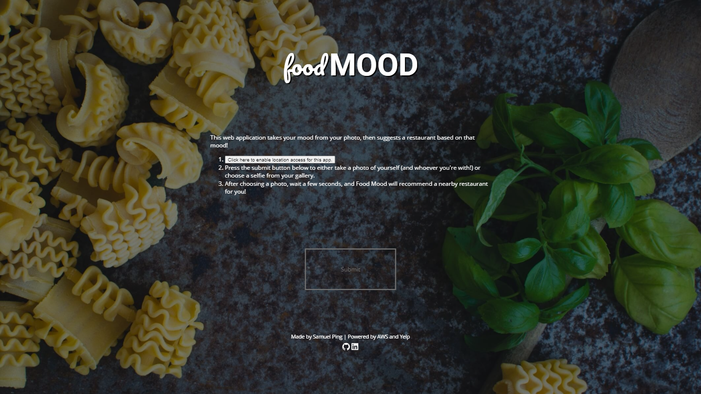
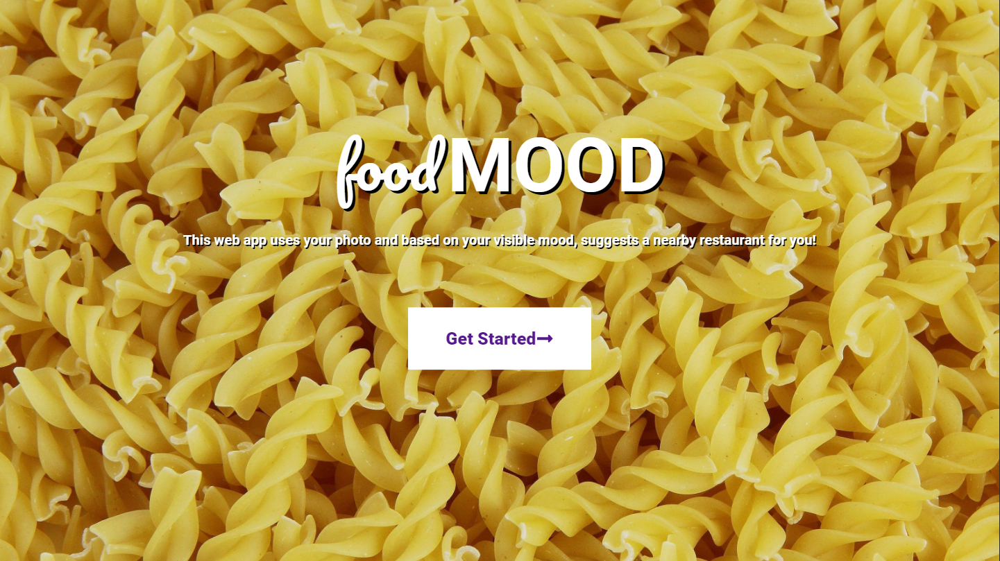
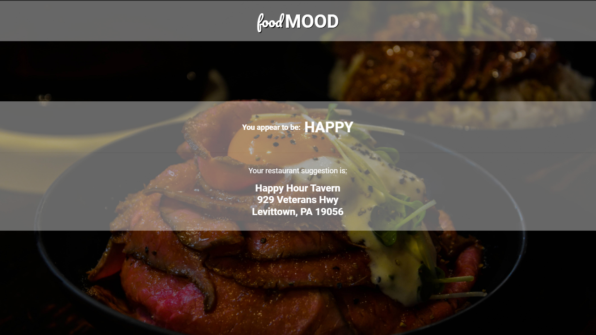
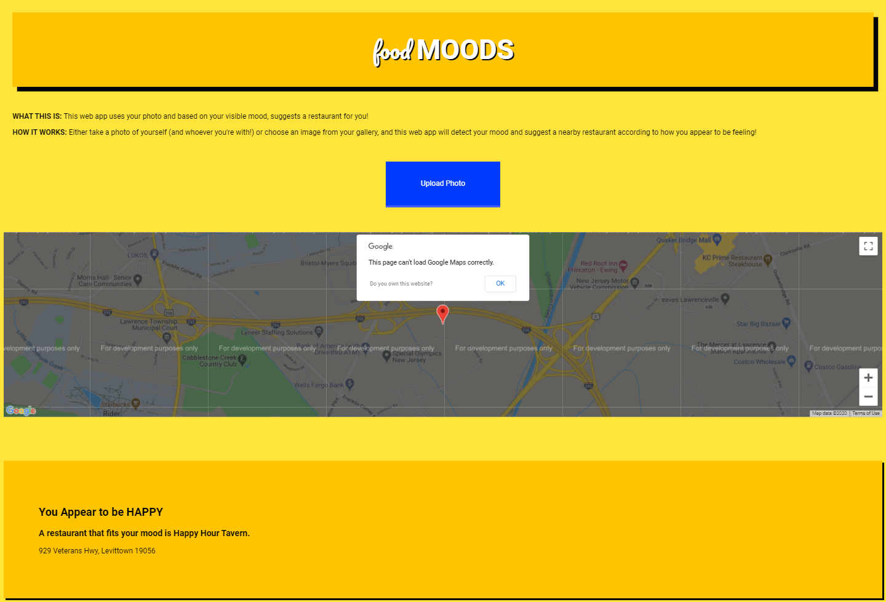

# Food Mood

Food Mood is a web application that uses your current location and selfie to suggest a nearby restaurant!

##### Current Stack: React.js, Express.js, Node.js, hosted on AWS EC2 using Nginx.

### Food Mood v3

|  |
| :-------------------------------------------------------------: |
|                         _Landing Page_                          |

_Results Page_

I'm once again revamping Food Mood! I'm planning to go serverless by using an AWS Lambda function rather than hosting a whole server to make the API calls. I'm also making it look better.

### Food Mood v2

_Landing Page_

_Input Page_

_Results Page_

After the challenge ended, I decided to continue improving this project. I rebuilt this web app with React.js, Node.js and Express.js. It's an ERN stack! For determining the mood from the photo, I used Amazon Rekognition, and for determining the restaurant, I used Yelp's Fusion API. Since the free tier of Heroku is so slow, I manually deployed this app through an AWS EC2 instance using Nginx as a reverse proxy, and set up the security certificate. I also set up an AWS CodePipeline that automatically deploys changes to this website using AWS CodeDeploy.

### Food Mood v1

_Landing + Input + Results Page_

The first version of Food Mood was built as an entry to Capital One's Software Engineering Summit challenge. It was hosted server-side using Express.js, which delivered a static HTML page to the client. You can check out the original project here: https://github.com/samuel-ping/Old-Food-Mood and the original coding challenge here: https://www.mindsumo.com/contests/d052bcf8-4580-4922-95ef-a9f6ceaf0f10.
